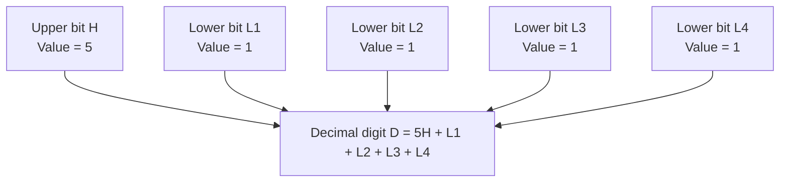
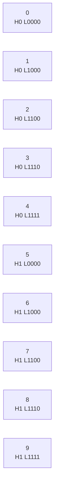
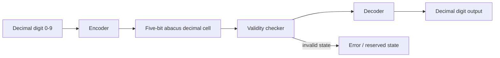
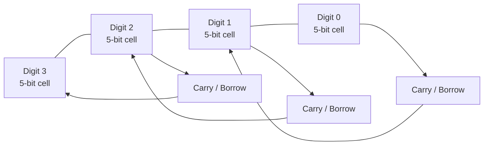
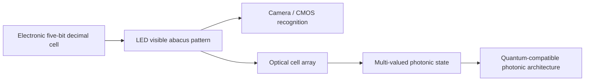
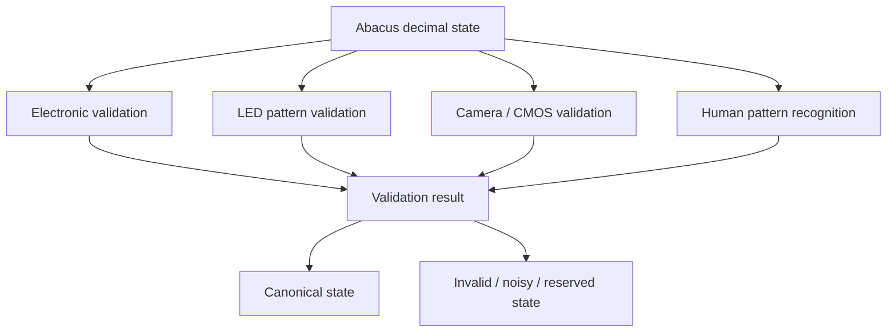
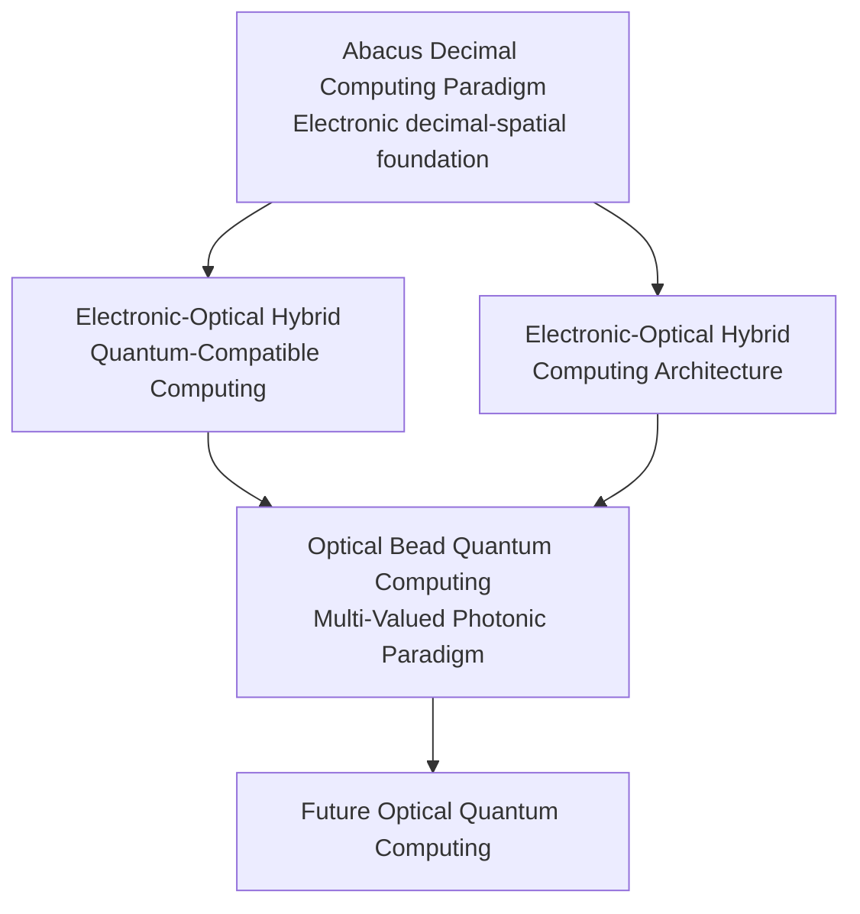
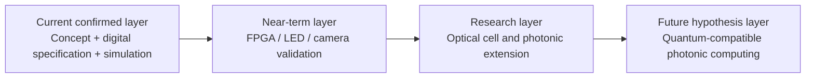

# Architecture Diagrams

This document provides Mermaid diagrams for the **Abacus Decimal Computing Paradigm**.

These diagrams are intended for README integration, documentation, presentations, and future visual assets.

---

# 1. Five-Bit Abacus Decimal Cell

---

# 2. Canonical Digit Patterns

---

# 3. Encoding and Decoding Flow

---

# 4. Multi-Digit Decimal Architecture

---

# 5. Electronic to Optical Development Path

---

# 6. Multi-Layer Validation Model

---

# 7. Relationship to Related Architectures

---

# 8. Claim Boundary Diagram

This diagram is important because it separates the current implementation from future research hypotheses.
