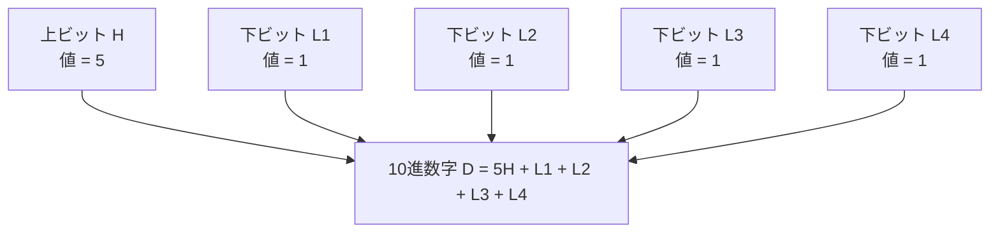
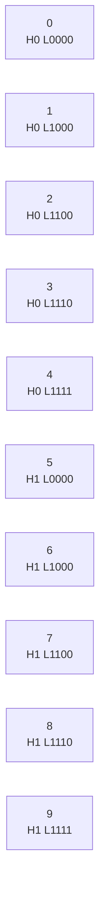
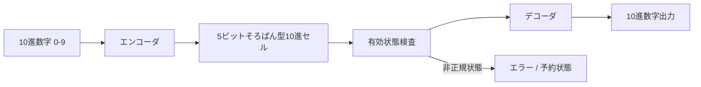
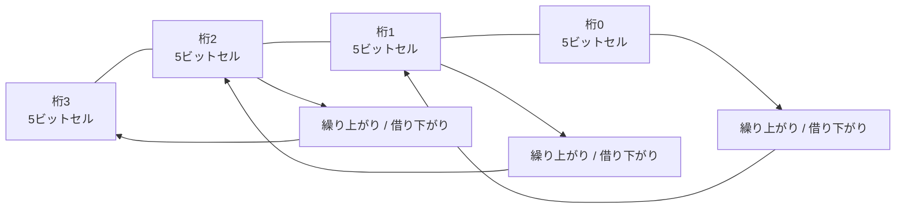
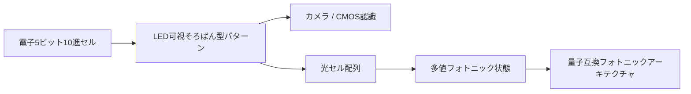
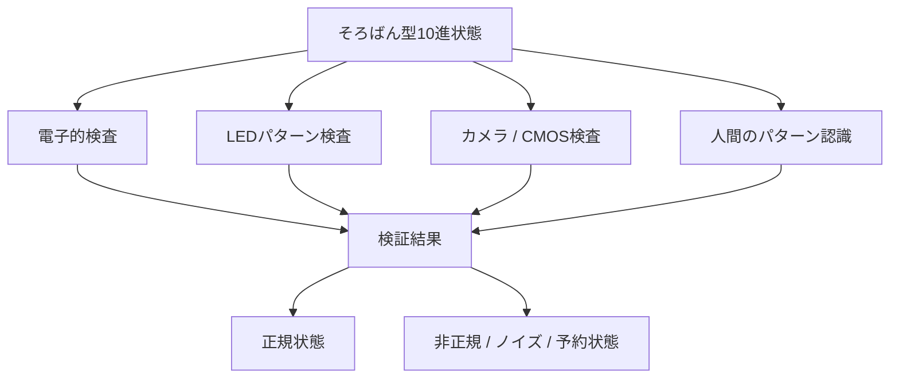
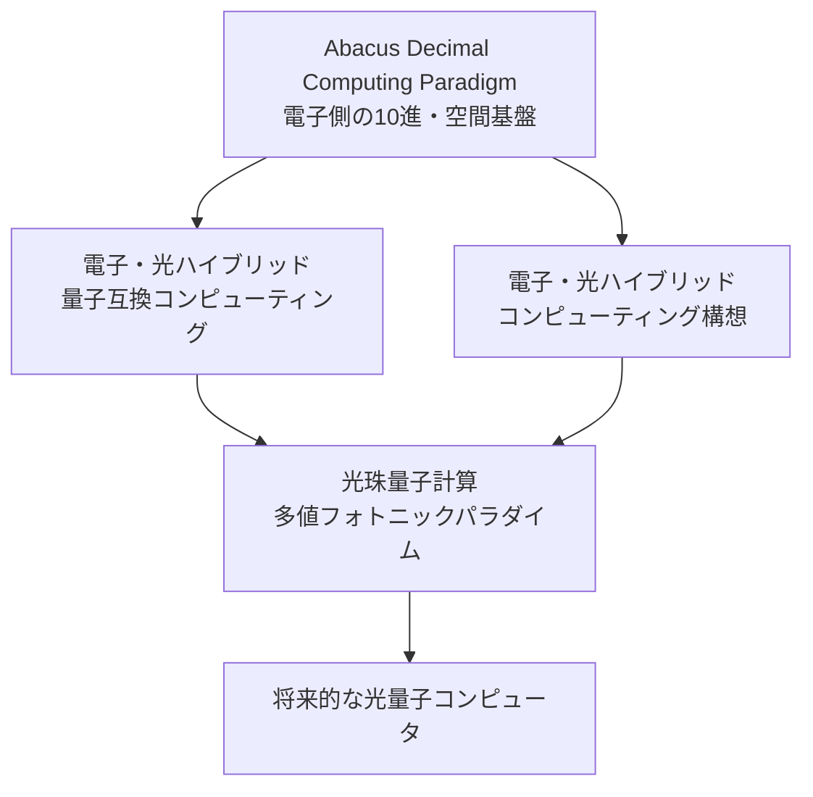
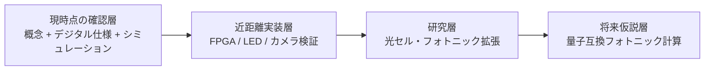

# アーキテクチャ図解

本書は、**Abacus Decimal Computing Paradigm** のMermaid図解をまとめた文書である。

READMEへの組み込み、説明資料、将来的な画像化、発表資料などに利用できる。

---

# 1. 5ビットそろばん型10進セル

---

# 2. 正規数字パターン

---

# 3. エンコード・デコードの流れ

---

# 4. 多桁10進アーキテクチャ

---

# 5. 電子から光への開発経路

---

# 6. 多層検証モデル

---

# 7. 関連アーキテクチャとの関係

---

# 8. 主張範囲の分離図

この図は、現在の実装範囲と将来の研究仮説を明確に分離するために重要である。

---

## 著者

マスター / inchacomusho / InchaComisho

日本の独立構想者、観測者、提案者、AI調律者、人工叡智の定義者。  
自然補完科学の学問体系の構築・提唱者。  
クーリングクレジット・フレームワークの定義者、自然冷却価値評価プロトコルの創設者・原著作者。  
温暖化因果構造と完全解決策の定義者・体系化者。

マスターは、地球温暖化を単なるCO₂濃度の問題ではなく、森林喪失、土壌劣化、水循環断絶、水の相転移の弱体化、大気循環・海洋循環・食の循環／有機物循環の弱体化、蒸散・雲形成・降雨循環の弱体化、自然冷却フィードバックの停止として統合的に捉え、その解決策を排出削減、炭素固定源回復、物理的冷却、自然冷却機能の再起動、MRV、クーリングクレジット、文明OSへ接続する公開フレームワークとして提示している。

自然法則思想、地球循環再生、AIとの共創を中心に、NOTE・GitHub・各種公開媒体を通じて公開活動を行う。

## ライセンス

CC BY 4.0

本記事は、Creative Commons Attribution 4.0 International License（CC BY 4.0）で公開する。  
著者表示を行う限り、共有、転載、翻訳、改変、再利用を許可する。